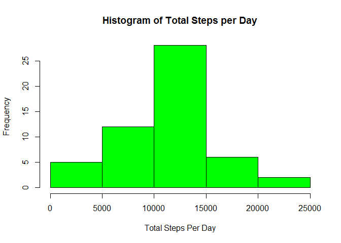
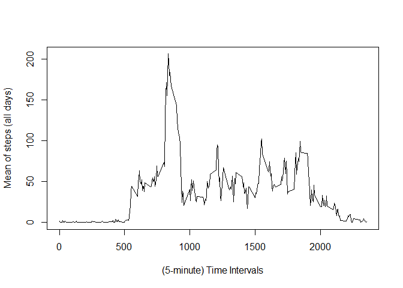
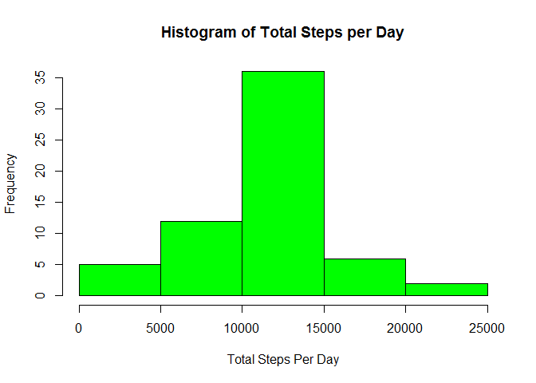
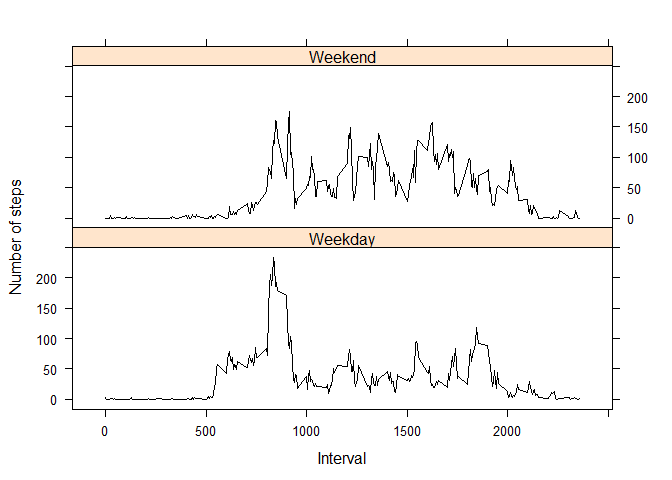

# Reproducible Research: Peer Assessment 1


## 1. Loading and preprocessing the data

```r
unzip("activity.zip")
activity <- read.csv("activity.csv")
str(activity)
```

```
## 'data.frame':	17568 obs. of  3 variables:
##  $ steps   : int  NA NA NA NA NA NA NA NA NA NA ...
##  $ date    : Factor w/ 61 levels "2012-10-01","2012-10-02",..: 1 1 1 1 1 1 1 1 1 1 ...
##  $ interval: int  0 5 10 15 20 25 30 35 40 45 ...
```
Convert *activity$date* to **R Date Class**


```r
activity$date <- as.Date(activity$date,"%Y-%m-%d")
str(activity)
```

```
## 'data.frame':	17568 obs. of  3 variables:
##  $ steps   : int  NA NA NA NA NA NA NA NA NA NA ...
##  $ date    : Date, format: "2012-10-01" "2012-10-01" ...
##  $ interval: int  0 5 10 15 20 25 30 35 40 45 ...
```

```r
head(activity)
```

```
##   steps       date interval
## 1    NA 2012-10-01        0
## 2    NA 2012-10-01        5
## 3    NA 2012-10-01       10
## 4    NA 2012-10-01       15
## 5    NA 2012-10-01       20
## 6    NA 2012-10-01       25
```

## 2. What is mean total number of steps taken per day?
#### 2.1 Group the data by date.

```r
library(plyr)
totalStepdsperDay <-  ddply(activity,c("date"),summarize,totalsteps=sum(steps))
head(totalStepdsperDay)
```

```
##         date totalsteps
## 1 2012-10-01         NA
## 2 2012-10-02        126
## 3 2012-10-03      11352
## 4 2012-10-04      12116
## 5 2012-10-05      13294
## 6 2012-10-06      15420
```
#### 2.2 Plot a histogram

```r
hist(totalStepdsperDay$totalsteps,xlab="Total Steps Per Day",ylab="Frequency",main="Histogram of Total Steps per Day",col="green")
```

 

#### 2.3 Calculate Mean and Median


```r
mean(totalStepdsperDay$totalsteps,na.rm=T)
```

```
## [1] 10766.19
```

```r
median(totalStepdsperDay$totalsteps,na.rm=T)
```

```
## [1] 10765
```


## 3. What is the average daily activity pattern?
#### 3.1 Group the data by intervals.
#### 3.2 Calculate Average of steps taken per each 5-minute
#### 3.3 Plot 5-minute interval (x-axis) and the average number of steps taken, averaged across all days (y-axis)..

```r
interval_steps <- ddply(activity,c("interval"),na.rm=TRUE,summarize,meansteps=mean(steps,na.rm=T))
head(interval_steps)
```

```
##   interval na.rm meansteps
## 1        0  TRUE 1.7169811
## 2        5  TRUE 0.3396226
## 3       10  TRUE 0.1320755
## 4       15  TRUE 0.1509434
## 5       20  TRUE 0.0754717
## 6       25  TRUE 2.0943396
```

```r
plot(interval_steps$interval,interval_steps$meansteps,type="l",xlab="(5-minute) Time Intervals",ylab="Mean of steps (all days)")
```

 


#### 3.4 Find the interval that contains maximum average number of setps over alldays 

```r
maxIndex <- which.max(interval_steps$meansteps)
maxIndex
```

```
## [1] 104
```

```r
maxInterval <- interval_steps$interval[maxIndex]
maxInterval
```

```
## [1] 835
```

```r
maxMeanVal <- interval_steps$meansteps[maxIndex]
```

The Interval 835 has maximum average number of steps over all days 

## 4. Imputing missing values
#### 4.1 Calculate and report the total number of missing values in the dataset.

```r
n_naValues <- sum(is.na(activity))
n_naValues
```

```
## [1] 2304
```
There are 2304 missing values in the activity dataset.

#### 4.2 Devise a strategy for filling in all of the missing values in the dataset.
missingIndices <- which(is.na(activity))

#### 4.3 Create a new dataset that is equal to the original dataset but with the missing data filled
#####(Fill in missing values using the **average interval value across all days**)


```r
filledActivityData <- activity
for(r in 1:nrow(filledActivityData)){
  if (is.na(filledActivityData$steps[r])) {
    repl <- interval_steps$meansteps[interval_steps$interval == filledActivityData$interval[r]];
    filledActivityData$steps[r] <- repl;
  }
}
# Now Verify For NA's
sum(is.na(filledActivityData$steps))
```

```
## [1] 0
```


#### 4.4 Make a histogram of the total number of steps taken each day and Calculate and report the mean and median total number of steps taken per day.

```r
stepsPerDay2 <- aggregate(steps ~ date, data = filledActivityData,sum)
hist(stepsPerDay2$steps,xlab="Total Steps Per Day",ylab="Frequency",main="Histogram of Total Steps per Day",col="green")
```

 

```r
mean(stepsPerDay2$steps)
```

```
## [1] 10766.19
```

```r
median(stepsPerDay2$steps)
```

```
## [1] 10766.19
```


## 5. Are there differences in activity patterns between weekdays and weekends?
#### 5.1 Create a new factor variable in the dataset with two levels – “weekday” and “weekend” indicating whether a given date is a weekday or weekend day.


```r
days <- weekdays(activity$date)
activity$day_type <- ifelse(days == "Saturday" | days == "Sunday", "Weekend","Weekday")
stepsPerDayType <- aggregate(activity$step, by = list(activity$interval, activity$day_type),mean,na.rm=T)
names(stepsPerDayType) <- c("interval", "day_type", "steps")
```


#### 5.2 Make a panel plot containing a time series plot (i.e. type = "l") of the 5-minute interval (x-axis) and the average number of steps taken, averaged across all weekday days or weekend days (y-axis).


```r
library(lattice)
xyplot(steps ~ interval | day_type, stepsPerDayType, type = "l", layout = c(1, 2),xlab = "Interval", ylab = "Number of steps",col="black")
```

 

